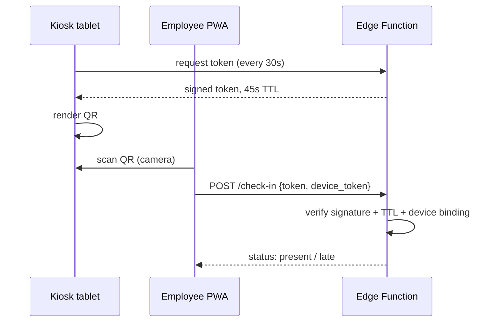
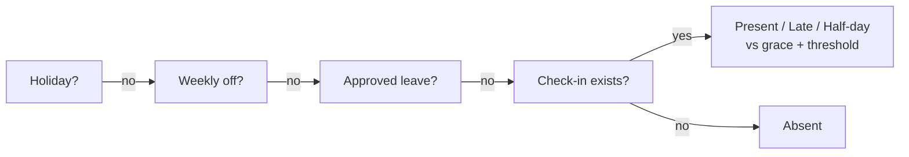

# Office Attendance System — PRD

2026-09-17 · @Someone

## 1. Overview & goals

A custom attendance system for one office, under 20 employees, built on the existing Next.js + Supabase + Vercel stack so attendance feeds payroll directly and ELIZA OS later.

**Why build:** full control over BD-specific rules (variable weekends, govt holidays, deduction conventions), zero per-seat SaaS cost, native Supabase integration.

**Success criteria**

- Every employee's daily status computes automatically with zero manual entry
- Monthly deduction sheet generates in one click, accepted by accounts without disputes
- Buddy punching and remote check-in are structurally impossible
- Manual corrections are rare and fully audit-trailed

## 2. Scope

**v1 (build now)**

- Office check-in/out via rotating QR on a kiosk tablet
- Device binding — one registered device per employee
- Shifts, per-employee weekends, BD holiday calendar
- Daily status engine (present / late / half-day / absent / leave / weekend / holiday)
- Leave management: types, balances, request → approval
- Monthly close: deduction computation + CSV export for accounts
- Admin panel with manual correction + audit log
- Employee app as a PWA (installable web app, camera-based QR scan)

**Deferred (schema-ready, not built)**

- Field-staff module: GPS geofence + selfie + mock-location flags — low probability need, tables designed to accept it without migration
- Face matching — unnecessary at this headcount; rotating QR + device binding covers it
- Full salary computation — v1 exports deductions only
- Leave carry-forward / encashment

## 3. Users & roles

| Role | Who | Can do |
| --- | --- | --- |
| Employee | All staff | Check in/out, view own attendance + leave balance, request leave |
| Admin | Owner / HR | Everything: employee CRUD, shift + holiday config, approve leave, manual corrections, monthly close, reports |
| Kiosk | Tablet device | Display rotating QR only — no data access |

At this headcount a separate manager role adds nothing; admin approves leave and corrections. Roles enforce via Supabase Auth + RLS.

## 4. Check-in system

One Android tablet at the entrance runs a fullscreen kiosk page showing a QR that refreshes every 30 seconds. The QR encodes an HMAC-signed token with a 45-second expiry. Employees scan it from their own phone (PWA camera); the server accepts the check-in only if the token signature is valid, unexpired, and the request comes from that employee's bound device.

**Rules**

- First scan of the day = check-in; last scan after shift start = check-out. Same QR, no separate mode.
- Device binding: device token minted at first login, stored on the phone; a new device requires admin approval before it can check in.
- Kiosk page is a dumb display authenticated by a kiosk key — it holds no employee data.
- Missed check-out: day flags for admin review, not auto-absent.

Why rotating QR beats GPS: a 45-second signed token can only be scanned by someone standing at the entrance. Sharing a photo of it on WhatsApp fails by the time it arrives; GPS spoofing is irrelevant.

## 5. Attendance rules

Each employee carries a `shift_id` and a `weekly_off` array — `{5}` = Friday, `{0}` = Sunday, `{5,6}` = Friday + Saturday. Shifts define start/end, a grace window, and a half-day threshold.

Daily status resolves in strict priority order — one SQL function, one source of truth, every report reads from it:

**Timing rules**

- Check-in within `grace_min` of shift start → present
- After grace, before `half_day_after_min` → late
- After half-day threshold → half-day
- Late/half-day boundaries and grace live in the `shifts` row — config, never code
- Ramadan: a date-ranged shift override (shorter hours) applies automatically when active

## 6. Leave management

Annual quotas per type, BD Labour Act baseline (adjust to your policy):

| Type | Quota / year | Paid |
| --- | --- | --- |
| Casual | 10 | Yes |
| Sick | 14 | Yes |
| Earned | 1 per 18 days worked | Yes |
| Unpaid | Unlimited | No — deducts |

**Flow:** employee submits request (type, dates, reason) → admin approves or rejects → approved days feed the daily status engine as `leave`. Balance decrements on approval; rejection or cancellation restores it.

Half-day leave supported (0.5 units). No carry-forward or encashment in v1.

## 7. Payroll deductions & monthly close

Deduction rules are a config table, editable by admin:

| Rule | Default | Notes |
| --- | --- | --- |
| Lates per absent-day | 3 lates = 1 absent | Common BD convention — confirm |
| Absent day | gross / 30 | Per-day rate |
| Half-day | 0.5 × day rate | — |
| Unpaid leave day | 1 × day rate | — |

**Monthly close** (admin-triggered on the 1st): locks the prior month's daily statuses, applies deduction rules, writes `payroll_adjustments` rows, exports CSV.

**CSV columns:** employee\_id, name, working\_days, present, late, half\_days, absents, leave\_paid, leave\_unpaid, deduction\_days, deduction\_amount. Accounts consumes this directly; ELIZA OS can ingest the same table later.

## 8. Reports & admin panel

- **Today view (admin):** live grid — who's in, late, absent, on leave; missed check-outs flagged
- **Monthly sheet:** per-employee row with the exact CSV columns above; this is what HR judges the software by
- **Trends:** late/absent counts per employee over the last 3 months
- **Employee self-view:** own calendar, leave balance, request history
- **Manual correction:** admin can override any day's status with a mandatory reason; every override writes to `audit_log` (who, when, old → new, reason). Corrections after monthly close are blocked — reopen the month explicitly.

## 9. Data model

| Table | Key columns | Purpose |
| --- | --- | --- |
| employees | shift\_id, weekly\_off smallint\[\], joined\_at, active | Staff master; weekend per person |
| devices | employee\_id, device\_token, status (pending/approved/revoked) | Device binding |
| shifts | start\_time, end\_time, grace\_min, half\_day\_after\_min | Timing config |
| shift\_overrides | shift\_id, date\_from, date\_to, start\_time, end\_time | Ramadan / seasonal hours |
| holidays | date pk, name | BD govt calendar, admin-managed |
| check\_ins | employee\_id, ts, kind (in/out), token\_jti, meta jsonb | Raw scans; meta holds future GPS/selfie refs |
| daily\_status | employee\_id, date, status, late\_min, source (auto/manual) | Materialized by nightly job |
| leave\_types | name, annual\_quota, paid | Config |
| leave\_balances | employee\_id, type\_id, year, used, quota | Per-year balances |
| leave\_requests | employee\_id, type\_id, from, to, half\_day, status | Request → approval |
| deduction\_rules | key, value | Lates-per-absent etc. |
| payroll\_adjustments | employee\_id, month, deduction\_days, amount | Monthly close output |
| audit\_log | actor, action, entity, old, new, reason, ts | Every manual change |

`token_jti` on check\_ins makes each QR token single-use — a replayed token is rejected. `check_ins.meta` is where the deferred field module lands (gps, accuracy, selfie\_url, mock\_flag) with no migration.

## 10. Architecture

One Next.js app on Vercel, three surfaces:

- `/kiosk` — fullscreen QR display, authenticated by a kiosk key env, auto-refreshing
- `/` — employee PWA: QR scanner (getUserMedia), own calendar, leave requests; installable, works on any phone
- `/admin` — dashboard, config, approvals, monthly close

**Supabase**

- Postgres + RLS: employees read only their own rows; admin role sees all; kiosk key sees nothing
- Edge Functions: `mint-token` (HMAC-sign QR payload, 45s TTL), `check-in` (verify signature + jti unused + device approved → insert)
- pg\_cron: nightly `daily_status` materialization at 23:55; monthly close is admin-triggered
- Auth: email/phone OTP login; device token minted on first successful login

No Storage bucket needed in v1 (selfies deferred). Token secret rotates via env. Everything reuses the existing Supabase project patterns already running for 19BAY.

## 11. Anti-fraud & known limits

| Attack | Defense |
| --- | --- |
| Share QR photo on WhatsApp | 45s token expiry + single-use jti — dead before it arrives |
| Buddy punching (colleague scans for you) | Device binding — scan only counts from your approved device |
| Hand your phone to a colleague | Possible in theory; requires giving up your phone daily and both being present at the kiosk — visible in a 20-person office. Accepted risk at this size |
| GPS spoofing | Irrelevant — presence proven by scanning the live kiosk QR |
| Reset app / clear storage | Device token gone → re-approval by admin, who sees the change |
| Video-call the kiosk screen and scan remotely | The one real hole. Mitigation if ever needed: kiosk-side scan instead (employee shows QR, tablet camera scans) or optional wifi-SSID check |

Honest bottom line: this stack is stronger than fingerprint devices for buddy punching (fingerprints can't be lent, but ZKTeco logs get manually edited; here every record is signed and audit-logged) and it costs one tablet.

## 12. Build plan

Solo builder, part-time alongside other work — roughly 3–4 weeks:

| # | Milestone | Delivers |
| --- | --- | --- |
| 1 | Schema + auth + admin CRUD | employees, devices, shifts, holidays, RLS |
| 2 | Kiosk + check-in flow | mint-token, /kiosk page, PWA scanner, device binding |
| 3 | Status engine + today view | daily\_status job, resolution function, live dashboard |
| 4 | Leave module | types, balances, request → approval, feeds status |
| 5 | Monthly close | deduction rules, payroll\_adjustments, CSV export |
| 6 | Polish | manual correction + audit log, monthly sheet, self-view |

Go live after milestone 3 — run it read-only alongside the current process for two weeks to shake out shift/weekend config before deductions ever touch salary.

## 13. Open decisions

- [ ] PWA vs React Native wrapper — PWA assumed (faster ship, no store); RN gives a stabler device ID if binding via localStorage proves flaky
- [ ] Check-out mandatory, or check-in only for v1?
- [ ] Deduction convention: confirm 3 lates = 1 absent-day, or your own rule
- [ ] Leave quotas: keep Labour Act baseline or set company numbers
- [ ] Holiday list: load 2026–27 BD govt calendar at setup — who maintains it after?
- [ ] Ramadan hours: confirm the override times before next Ramadan

